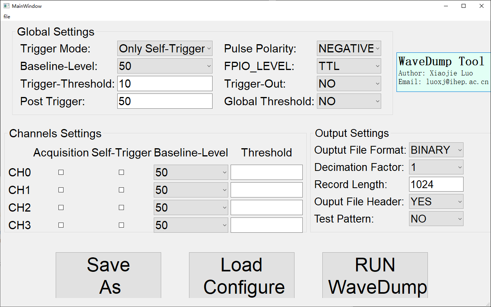

# WaveDump GUI Tool
**This is a GUI tool for CAEN WaveDump software for DT5751**

Key idea: Use GUI to input configure needed.  When click "Run WaveDump", python code will generate corresponding ConfigureFile.txt for Wavedump and run the Wavedump software.

GUI Window like:

## Installation
```
# copy WaveDumpTool.py, ConfigureFileTemplate.txt and WaveDumpTool.exe to where the wavedump be installed
# For example,the default path:
WaveDumpTool.py,ConfigureFileTemplate.txt and WaveDumpTool.exe -> 'C:\Program Files (x86)\CAEN\Digitizers\WaveDump\bin'
```
## Usage
For Windows:
    double click WaveDumpTool.exe to execute the tool
* If WaveDump is installed in default path,WaveDumpTool.exe should be run as administrator which allow it to modify ConfigureFile.txt.

For Linux:
```
python WaveDumpTool.py 
```
* PyQt5 and numpy package should be installed manually

## Button
1. "Save As": Save windows parameters as npz format which can be loaded by button "Load Configure"
2. "Load Configure": Load Window parameters from npz file
3. "Run WaveDump": Use the parameters set by GUI to generate ConfigureFile.txt and run WaveDump.exe application


